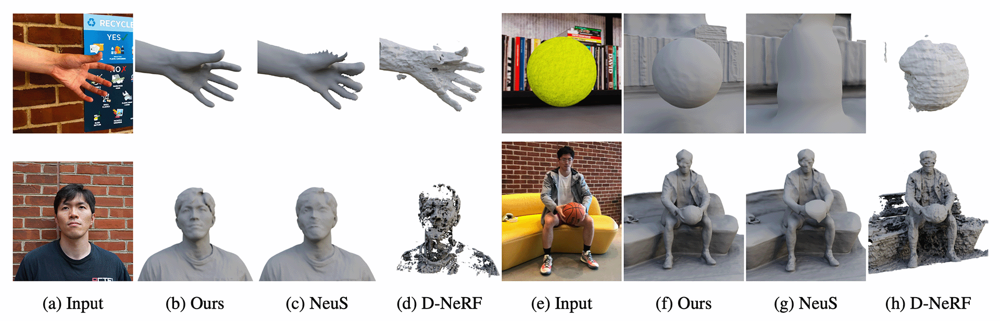

# NeuPhysics: Editable Neural Geometry and Physics from Monocular Videos

[Yi-Ling Qiao*](https://ylqiao.net/), [Alexander Gao*](https://gaoalexander.github.io/), [Ming C. Lin](https://www.cs.umd.edu/~lin/)

## [Paper](https://arxiv.org/abs/2210.12352) | [Project Page](https://sites.google.com/view/neuphysics/home) | [Video](https://www.youtube.com/watch?v=Eklh1pIAri0)

We present a method for learning 3D geometry and physics parameters of a dynamic scene from only a monocular RGB video input.




## Setup
**This code has been tested on Ubuntu 20.04 with CUDA 11.3**

Clone this repository and install dependencies. (Recommended to create a new conda env or pipenv.)

```shell
git clone https://github.com/gaoalexander/neuphysics.git
cd neuphysics
pip install -r requirements.txt
```

<details>
  <summary> Dependencies (click to expand) </summary>
  - torch==1.11.0
  - opencv_python==4.5.5.64
  - trimesh==3.9.8
  - numpy==1.21.2
  - pyhocon==0.3.57
  - icecream==2.1.0
  - tqdm==4.50.2
  - scipy==1.7.0
  - PyMCubes==0.1.2
  - imageio=2.16.1
  - scikit-image=0.19.2

</details>

## Data
Download data and pretrained model weights on [Google Drive](https://drive.google.com/drive/folders/1PGHkcNolUZ3ld_e5jFtr8OB5_EMWB4sR?usp=sharing).

Extract `public_data` and `exp` directories into the top-level `neuphysics` directory.

### Data Convention
The data is organized as follows:

```
<case_name>
|-- cameras_xxx.npz    # camera parameters
|-- sparse_points_interest.ply    # contains scene ROI
|-- image
    |-- 000.png        # target image for each view
    |-- 001.png
    ...
|-- mask
    |-- 000.png        # target mask each view (For unmasked setting, set all pixels as 255)
    |-- 001.png
    ...
```

Here the `cameras_xxx.npz` follows the data format in [IDR](https://github.com/lioryariv/idr/blob/main/DATA_CONVENTION.md), where `world_mat_xx` denotes the world to image projection matrix, and `scale_mat_xx` denotes the normalization matrix.

## Running

- **Training without mask**

```shell
python run.py --mode train --conf ./confs/neuphysics_default.conf --case <case_name>
```

- **Extract surface from trained model for single frame/timestep** 

```shell
python run.py --mode validate_mesh --val_frame_idx <frame_index> --conf <config_file> --case <case_name> --is_continue # use latest checkpoint
```

- **Extract surface from trained model for entire motion sequence** 

```shell
python run.py --mode validate_mesh_sequence --conf <config_file> --case <case_name> --is_continue # use latest checkpoint
```

The corresponding mesh can be found in `exp/<case_name>/<exp_name>/meshes/<iter_steps>.ply`.

- **View interpolation**

```shell
python run.py --mode interpolate_<img_idx_0>_<img_idx_1> --conf <config_file> --case <case_name> --is_continue # use latest checkpoint
```

The corresponding image set of view interpolation can be found in `exp/<case_name>/<exp_name>/render/`.

- **Train physics parameters**
Download the pretrained model weights on this [Google Drive](
https://drive.google.com/file/d/1uyON8TfKojZ7ts1ZsrRrThEmKo9wlRqB/view?usp=share_link).

Install [warp](https://github.com/NVIDIA/warp) for differentiable simulation.

Run
```shell
python run.py --conf ./confs/womask.conf --case NeuS/custom/ball-motion3/preprocessed --mode train_physics_gravity_warp --is_continue
```

We are using warp because it runs on GPU and is much faster. We are also trying to provide the interface to [taichi](https://github.com/taichi-dev/taichi). 

## Train NeuPhysics with your own data

More information can be found in [preprocess_custom_data](https://github.com/Totoro97/NeuS/tree/main/preprocess_custom_data).

## Citation

If you find this repository helpful, please consider citing our paper as well as others that our work built upon:

```
@inproceedings{qiao2022neuphysics,
    author  = {Qiao, Yi-Ling and Gao, Alexander and Lin, Ming C.},
    title  = {NeuPhysics: Editable Neural Geometry and Physics from Monocular Videos},
    booktitle = {Conference on Neural Information Processing Systems (NeurIPS)},
    year  = {2022},
}

@article{wang2021neus,
      title={NeuS: Learning Neural Implicit Surfaces by Volume Rendering for Multi-view Reconstruction}, 
      author={Peng Wang and Lingjie Liu and Yuan Liu and Christian Theobalt and Taku Komura and Wenping Wang},
    journal={NeurIPS},
      year={2021}
}

@inproceedings{tretschk2021nonrigid,
    title = {Non-Rigid Neural Radiance Fields: Reconstruction and Novel View Synthesis of a Dynamic Scene From Monocular Video},
    author = {Tretschk, Edgar and Tewari, Ayush and Golyanik, Vladislav and Zollh\"{o}fer, Michael and Lassner, Christoph and Theobalt, Christian},
    booktitle = {{IEEE} International Conference on Computer Vision ({ICCV})},
    year = {2021},
}

@article{du2021_diffpd,
    author = {Du, Tao and Wu, Kui and Ma, Pingchuan and Wah, Sebastien and Spielberg, Andrew and Rus, Daniela and Matusik, Wojciech},
    title = {DiffPD: Differentiable Projective Dynamics},
    year = {2021},
    journal = {ACM Trans. Graph.},
}
         
```

## Acknowledgement

Our code borrows from [NeuS](https://github.com/Totoro97/NeuS) and [NonRigid NeRF](https://github.com/facebookresearch/nonrigid_nerf/).
Additionally, some code snippets are borrowed from [IDR](https://github.com/lioryariv/idr) and [NeRF-pytorch](https://github.com/yenchenlin/nerf-pytorch).

Thank you to the authors of these projects for their great work.
